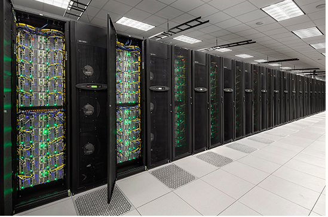
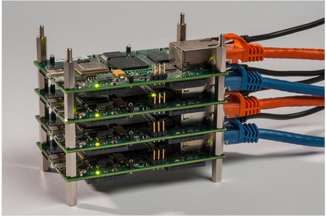
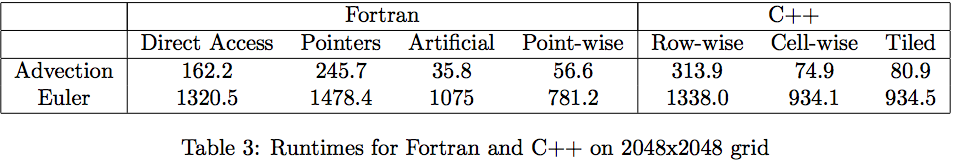
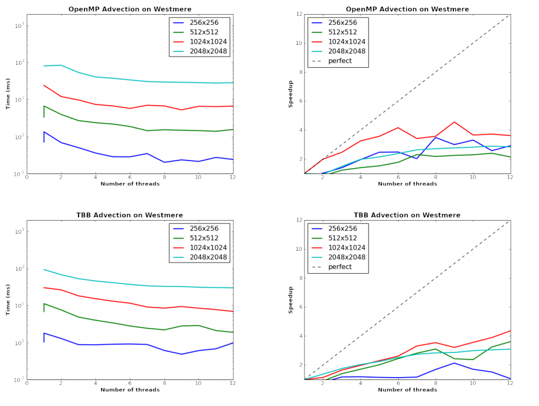

## ManyClaw and  
## Code Generation

> [Andy R. Terrel, PhD](http://andy.terrel.us)  
>  
> [ClawDev 2013 Workshop](http://clawpack.github.io/clawdev2013/)  
> slides at: [http://bit.ly/ClawDev2013_ManyClaw](http://bit.ly/ClawDev2013_ManyClaw)  

<br/><br/>
<sub>[slides by Reveal.js](http://lab.hakim.se/reveal-js/)</sub>

<aside class="notes">
Welcome to my talk.  Randy asked that we make this a discussion, so please feel
free to interrupt me at any point.  
</aside>


## Background
<aside class="notes">
Let's first start by talking about how this project got started, it's relation
to clawpack, and how I became involved.
</aside>


Science needs code.

<aside class="notes">
Everyone here probably recognizes the innovations brought to science through
scientific computing.  As science relys on code more heavily, it behooves us to
think about our relationship to it and the future of code.  Let's explore some
qualities that scientific code needs.
</aside>


Most scientists see code as a tax.

<aside class="notes">
Whether their advisors didn't code or they aren't very good at it, scientists
in general would rather avoid code.  I personally avoid writing, but it doesn't
mean it isn't part of science.  So anything to make a code less frustrating to
write, install, or run will help the success of a code and hence more
citations.
</aside>


Scientific codes need to be fast.

<aside class="notes">
While performance is not the only criteria, I put it on my list because
it is a often missed as a feature.  Performance can dictate everything about a
code and override all other features.  Another aspect to scientific code is
that it must scale up as there is always a bigger science problem to solve. As
most tech companies are dealing with web scale, and that changes the patterns
they use, scientists do well to think about science scale applications and use
patterns to grow their code.
</aside>


Scientific code needs to be robust, but not as robust as other software
products.

<aside class="notes">
We need our codes to be stable to inputs and work on a variety of computers.
But we errors are okay (i.e. they don't cost us millions of dollars) and we
typically can restart from known states.  
</aside>


My work research is two pronged:

- making scientific code fast but readable and
- creating robust tools and patterns for scientists,

<aside class="notes">
From this starting point, I have two basic goals.  To make science a better
place to code with fast, robust tools and patterns.  I typically like to work
embedded in a scientific group, currently I'm working with the Computational
Hydrology group at ICES.
</aside>


## High performance computing


HPC trends often dictate our future.

<aside class="notes">
HPC is hard, but it often predicts the technology of the future.  My concern is
usually the software features, not the performance, but if we want to push what
scientific codes can do, we have to 
- using hardware to it's full capability,
- running on problems much larger than is capable on a single laptop,
</aside>


Scaling to large machines is common.  Use MPI.



But small clusters are become a norm as well. 



Accelerators are everywhere*

- REQUIRE good vectorization of code,
- REQUIRE latency hiding of moving across PCI-e bus,
- Not always as fast as one thinks


Choices for on-node parallelism is becoming less clear
<ul>
<li class="fragment">OpenMP </li>
<li class="fragment">TBB </li>
<li class="fragment">OpenCL / CUDA </li>
<li class="fragment">ISPC</li>
</ul>


### [ManyClaw](http://github.com/Manyclaw/ManyClaw)

<ul>
<li class="fragment">Can ClawPack use massive multi-core architectures of the future?</li>
<li class="fragment">Can we (almost) reuse Riemann problems?</li>
<li class="fragment">Can we make use of caching and vectorization?</li>
<li class="fragment">Can this be maintainable?</li>
</ul>

<aside class="notes">
At KAUST we tried hacking together something quickly to test these ideas.  The
resulted in a workshop paper at the TACC-Intel Highly Parallel Symposium.
</aside>


#### Organization

- Handles 2D grids
- Only a few solvers implemented:
    - Advection
    - Acoustics (constant and variable coefficient)
    - Euler


### Major Milestones

See
[TerrelMandli2012](http://andy.terrel.us/static/papers_and_talks/tacc-intel2012.pdf)


- Showed that pointwise Riemann solvers were as fast as
(software) vectorized versions
- Tried several tiling structures. Decided a cellwise
iteration rather than a sweeping direction paid off.




- Compared OpenMP v TBB on CPU and MIC </li>





### Current state

- Working with Donna and Carsten to use in paper for ParCo.
- Went from 17KLOC very specific hardware speedups to 2K pretty general
- Not feature complete, just a prototype
- Needs a good application to drive forward


### Indexing

Recently added two classes to help with indexing (and make Riemann solvers more
general for different indexing methodologies)


```
struct FieldIndexer
{
  const unsigned nx, ny, num_ghosts, num_eqns;

  inline unsigned idx(int row, int col)
  inline unsigned up(int row, int col)
  inline unsigned down(int row, int col)
  inline unsigned left(int row, int col)
  inline unsigned right(int row, int col)
  inline unsigned num_row()
  inline unsigned num_col()
  inline unsigned size()
  inline unsigned row_size()
  inline unsigned col_size()
};
```


```
struct EdgeFieldIndexer
{
  const unsigned nx, ny, num_ghosts, num_eqns, num_wave;

  inline int num_row_edge_normal() const
  inline int num_row_edge_transverse() const
  inline int num_row_edge() const
  inline int num_col_edge_normal() const
  inline int num_col_edge_transverse() const
  inline int num_col_edge() const
  inline int num_edge() const
  inline int row_normal_size() const
  inline int row_transverse_size() const
  inline int col_normal_size() const
  inline int col_transverse_size() const
  inline int size() const
  inline int left_edge(const int row, const int col) const
  inline int right_edge(const int row, const int col) const
  inline int down_edge(const int row, const int col) const
  inline int up_edge(const int row, const int col) const
};

```


## [Ignition](http://github.com/IgnitionProject/Ignition)

<ul>
<li class="fragment">ManyClaw and CudaClaw represent a "hero" code experience.</li>
<li class="fragment">Can we abstract the ideas and generate the code.</li>
</ul>


- Simple DSls embedded in Python

```
from sympy import *
from ignition.dsl.int_gen import *

select_quad_rule(num_pts=2, name="Gauss")

u = DiscFunc("u")
x = Symbol("x")
cos_x = Func(cos(x), x)
sin_x = Func(sin(x), x)
dx = Dom(x, 0, 1)

integral = (cos_x * u + sin_x) * dx
gen_file("ex1", [integral], ["eval_gen"], ['u'])
```


- Riemann Code example

```
from sympy import Matrix

from ignition.dsl.riemann import *

q = Conserved('q')
(w,) = q.fields(['w'])
u = Constant('u')
f = [u * w]
```


- Generate to many different types of execution

```
g = Generator(flux=f, conserved=q)
g.eig_method = "symbolic"
g.write("advection_kernel.py")

c = ConstantField('c')
A = Matrix([[c*u]])
generate(A=A, conserved=q, constant_fields=[c],
         filename="variable_advection_kernel.py")

generate(A=A, conserved=q, constant_fields=[c], evaluation="vectorized",
         filename="variable_advection_vectorized_kernel.py")

generate(A=A, conserved=q, constant_fields=[c], evaluation="vectorized",
         eig_method="numerical",
         filename="variable_advection_numerical_vectorized_kernel.py")
```


### Current State

- Working on Strong Form Language for CHL at ERDC
- Creating a canonical code generator for all projects 
- Profiling many other code generators at [python-benchmarks](http://github.com/numfocus/python-benchmarks)


Thanks for your attention!
